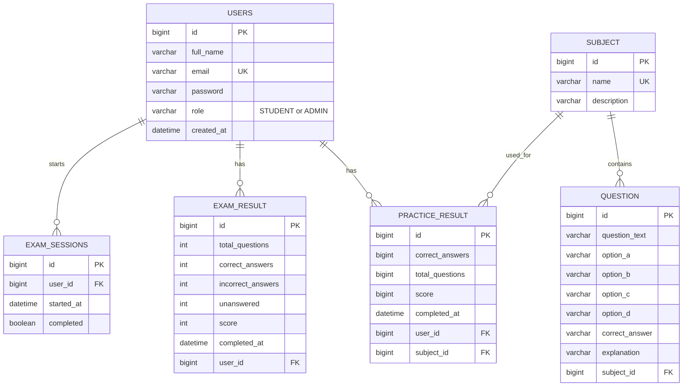

# Entity Relationship Diagram

```mermaid
erDiagram

    USERS ||--o{ PRACTICE_RESULT : has 
    USERS ||--o{ EXAM_RESULT : has 
    USERS ||--o{ EXAM_SESSIONS : starts 
    SUBJECT ||--o{ QUESTION : contains 
    SUBJECT ||--o{ PRACTICE_RESULT : used_for

    USERS {
        bigint id PK 
        varchar full_name 
        varchar email UK 
        varchar password 
        varchar role "STUDENT or ADMIN" 
        datetime created_at
    }

    EXAM_SESSIONS {
        bigint id PK
        bigint user_id FK
        datetime started_at
        boolean completed
    }

    SUBJECT {
        bigint id PK 
        varchar name UK 
        varchar description
    }

    QUESTION {
        bigint id PK 
        varchar question_text 
        varchar option_a 
        varchar option_b 
        varchar option_c 
        varchar option_d 
        varchar correct_answer 
        varchar explanation 
        bigint subject_id FK
    }

    PRACTICE_RESULT {
        bigint id PK 
        bigint correct_answers 
        bigint total_questions 
        bigint score 
        datetime completed_at 
        bigint user_id FK 
        bigint subject_id FK
    }

    EXAM_RESULT {
        bigint id PK 
        int total_questions 
        int correct_answers 
        int incorrect_answers 
        int unanswered 
        int score 
        datetime completed_at 
        bigint user_id FK
    }
```