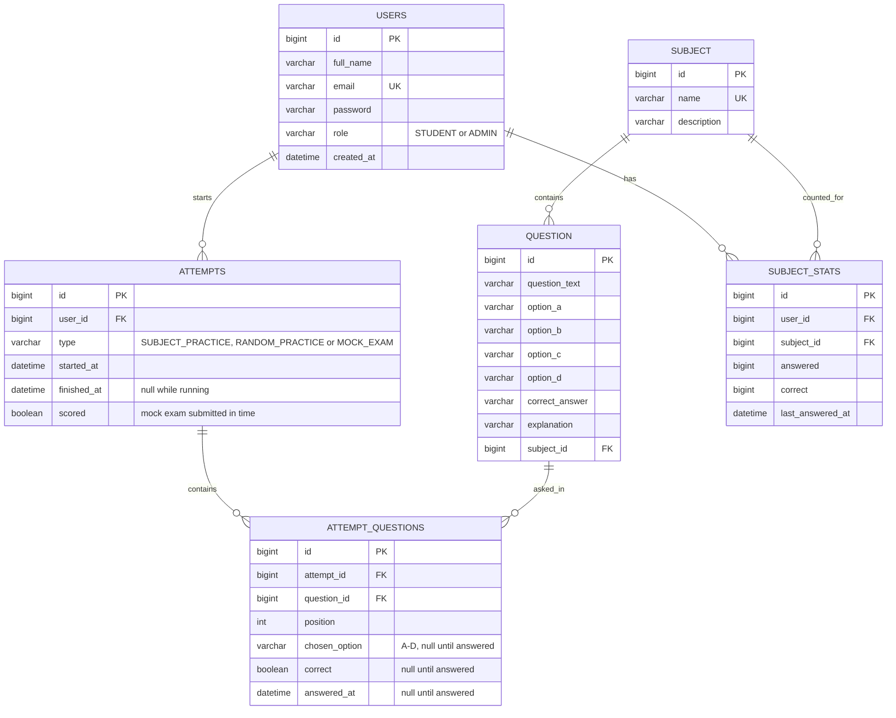

# Entity Relationship Diagram

```mermaid
erDiagram

    SUBJECT ||--o{ QUESTION : contains 
    USERS ||--o{ ATTEMPTS : starts
    ATTEMPTS ||--o{ ATTEMPT_QUESTIONS : contains
    QUESTION ||--o{ ATTEMPT_QUESTIONS : asked_in
    USERS ||--o{ SUBJECT_STATS : has
    SUBJECT ||--o{ SUBJECT_STATS : counted_for

    USERS {
        bigint id PK 
        varchar full_name 
        varchar email UK 
        varchar password 
        varchar role "STUDENT or ADMIN" 
        datetime created_at
    }

    SUBJECT {
        bigint id PK 
        varchar name UK 
        varchar description
    }

    QUESTION {
        bigint id PK 
        varchar question_text 
        varchar option_a 
        varchar option_b 
        varchar option_c 
        varchar option_d 
        varchar correct_answer 
        varchar explanation 
        bigint subject_id FK
    }

    ATTEMPTS {
        bigint id PK
        bigint user_id FK
        varchar type "SUBJECT_PRACTICE, RANDOM_PRACTICE or MOCK_EXAM"
        datetime started_at
        datetime finished_at "null while running"
        boolean scored "mock exam submitted in time"
    }

    ATTEMPT_QUESTIONS {
        bigint id PK
        bigint attempt_id FK
        bigint question_id FK
        int position
        varchar chosen_option "A-D, null until answered"
        boolean correct "null until answered"
        datetime answered_at "null until answered"
    }

    SUBJECT_STATS {
        bigint id PK
        bigint user_id FK
        bigint subject_id FK
        bigint answered
        bigint correct
        datetime last_answered_at
    }
```