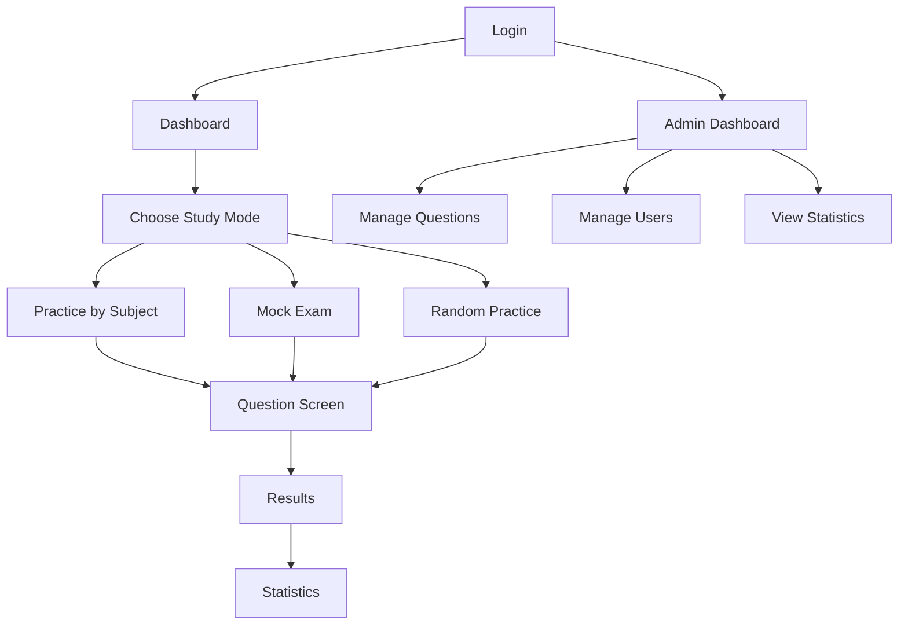

# UI Navigation Flow

```mermaid
flowchart TD

    A[Login]

    A --> B[Dashboard]

    B --> C[Choose Study Mode]

    C --> D[Practice by Subject]
    C --> E[Mock Exam]
    C --> F[Random Practice]

    D --> G[Question Screen]
    E --> G
    F --> G

    G --> H[Results]

    H --> I[Statistics]

    A --> J[Admin Dashboard]

    J --> K[Manage Questions]

    J --> L[Manage Users]

    J --> M[View Statistics]
```