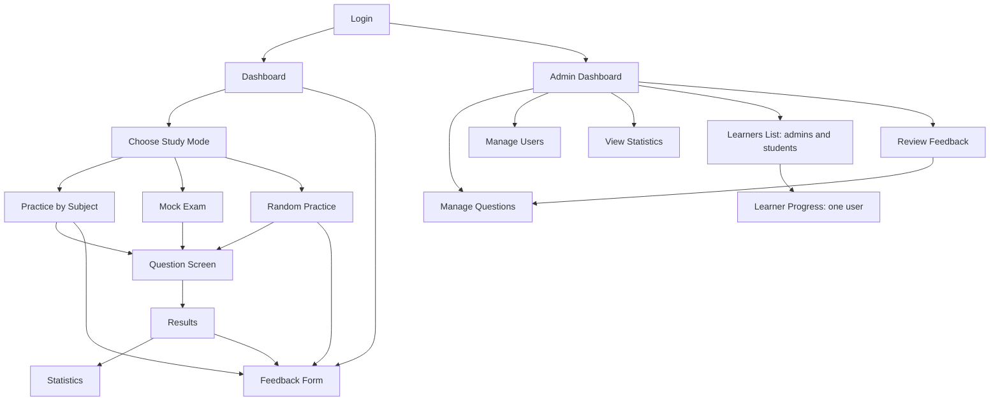

# UI Navigation Flow

```mermaid
flowchart TD

    A[Login]

    A --> B[Dashboard]

    B --> C[Choose Study Mode]

    C --> D[Practice by Subject]
    C --> E[Mock Exam]
    C --> F[Random Practice]

    D --> G[Question Screen]
    E --> G
    F --> G

    G --> H[Results]

    H --> I[Statistics]

    D --> P[Feedback Form]
    F --> P
    H --> P
    B --> P

    A --> J[Admin Dashboard]

    J --> K[Manage Questions]

    J --> L[Manage Users]

    J --> M[View Statistics]

    J --> N[Learners List: admins and students]

    N --> Q[Learner Progress: one user]

    J --> O[Review Feedback]

    O --> K

```