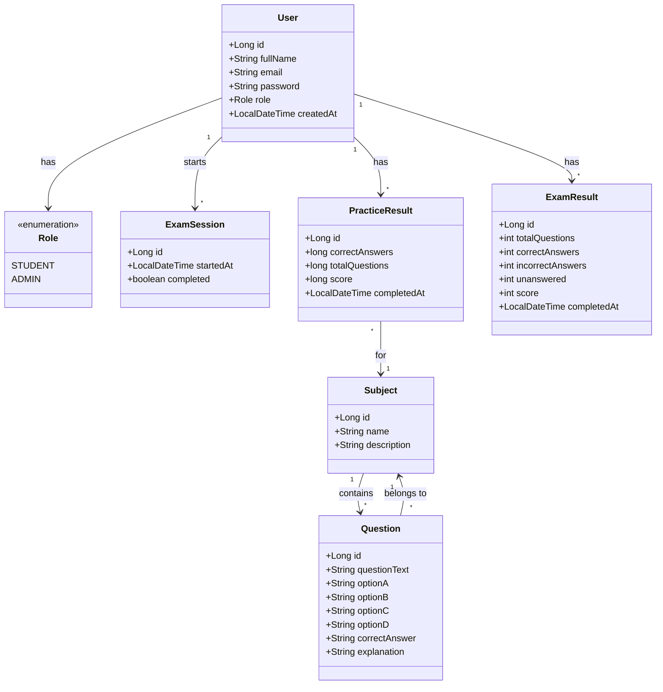

# UML Class Diagram

```mermaid
classDiagram

class User {
    +Long id 
    +String fullName 
    +String email 
    +String password 
    +Role role 
    +LocalDateTime createdAt
}

class Role {
    <<enumeration>>
    STUDENT
    ADMIN
}

class ExamSession {
    +Long id
    +LocalDateTime startedAt
    +boolean completed
}

class Subject { 
    +Long id 
    +String name 
    +String description 
}

class Question {
    +Long id
    +String questionText
    +String optionA
    +String optionB
    +String optionC
    +String optionD
    +String correctAnswer
    +String explanation
}

class PracticeResult { 
    +Long id 
    +long correctAnswers 
    +long totalQuestions 
    +long score 
    +LocalDateTime completedAt 
} 

class ExamResult { 
    +Long id 
    +int totalQuestions 
    +int correctAnswers 
    +int incorrectAnswers 
    +int unanswered 
    +int score 
    +LocalDateTime completedAt 
}

    User "1" --> "*" PracticeResult : has 
    User "1" --> "*" ExamResult : has 
    User "1" --> "*" ExamSession : starts 
    User --> Role : has 
    Subject "1" --> "*" Question : contains 
    PracticeResult "*" --> "1" Subject : for 
    Question "*" --> "1" Subject : belongs to
```