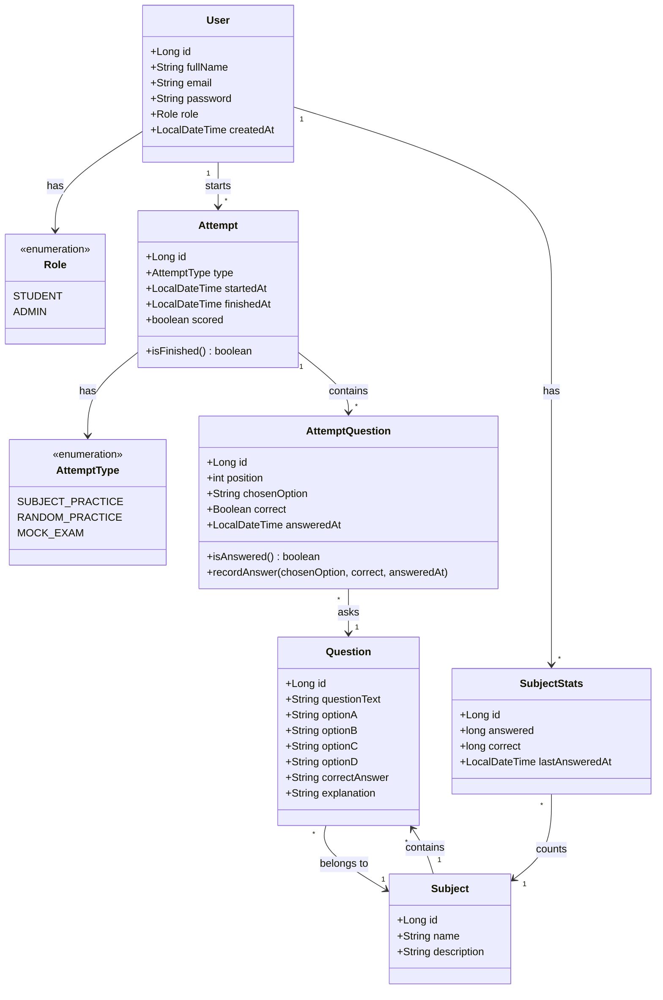

# UML Class Diagram

```mermaid
classDiagram

class User {
    +Long id 
    +String fullName 
    +String email 
    +String password 
    +Role role 
    +LocalDateTime createdAt
}

class Role {
    <<enumeration>>
    STUDENT
    ADMIN
}

class Subject { 
    +Long id 
    +String name 
    +String description 
}

class Question {
    +Long id
    +String questionText
    +String optionA
    +String optionB
    +String optionC
    +String optionD
    +String correctAnswer
    +String explanation
}

class Attempt {
    +Long id
    +AttemptType type
    +LocalDateTime startedAt
    +LocalDateTime finishedAt
    +boolean scored
    +isFinished() boolean
}

class AttemptType {
    <<enumeration>>
    SUBJECT_PRACTICE
    RANDOM_PRACTICE
    MOCK_EXAM
}

class AttemptQuestion {
    +Long id
    +int position
    +String chosenOption
    +Boolean correct
    +LocalDateTime answeredAt
    +isAnswered() boolean
    +recordAnswer(chosenOption, correct, answeredAt)
}

class SubjectStats {
    +Long id
    +long answered
    +long correct
    +LocalDateTime lastAnsweredAt
}

    User --> Role : has 
    User "1" --> "*" Attempt : starts
    Attempt --> AttemptType : has
    Attempt "1" --> "*" AttemptQuestion : contains
    AttemptQuestion "*" --> "1" Question : asks
    User "1" --> "*" SubjectStats : has
    SubjectStats "*" --> "1" Subject : counts
    Subject "1" --> "*" Question : contains 
    Question "*" --> "1" Subject : belongs to
```